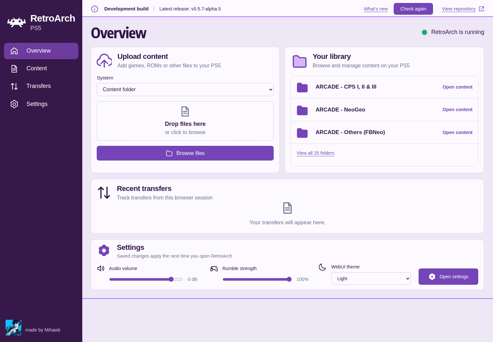
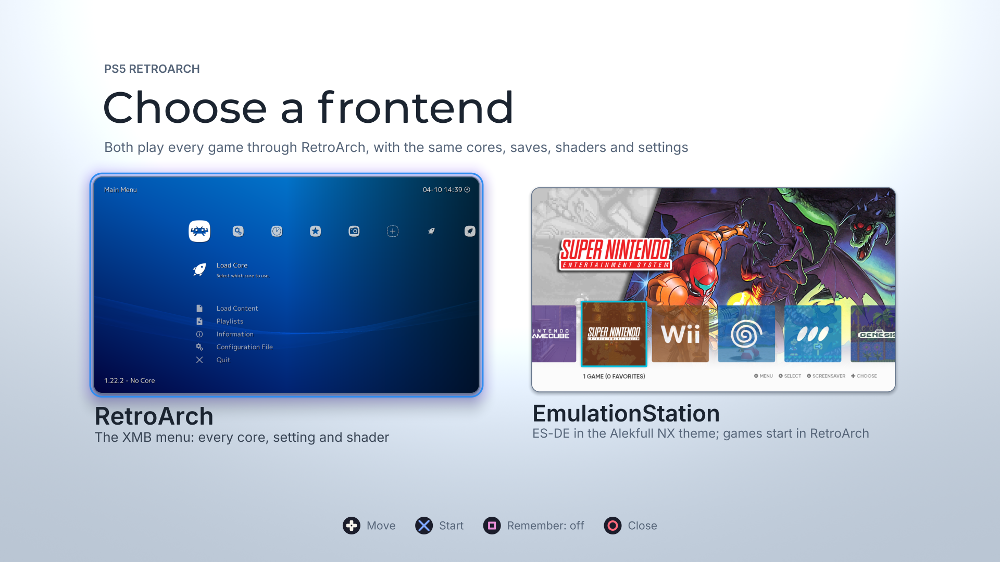

<div align="center">

# RetroArch for PS5

**Your collection on the console. Your controls in the browser.**

Native Vulkan rendering · Twenty-nine release cores · A local WebUI

[Download a release](https://github.com/mihawk-99/PS5_RetroArch/releases) · [Get started](#get-started) · [Supported systems](#supported-systems) · [Build from source](#build-from-source)

</div>


## PS5 RetroArch is a passion project, not a piracy project.

It exists so you can play the games you own on the console you own.

- **Piracy is not condoned.**
- **No games, BIOS files, console firmware or decryption keys are included, and they never will be.**
- **Use only legally obtained backups of games you own**, made yourself from your own discs, cartridges or digital purchases.
- **Use only BIOS and firmware files dumped from hardware you own.**
- **Requests for, or links to, games, BIOS files, firmware or keys are not welcome** in this project's issues or discussions.

---



<p align="center"><strong>WebUI Overview</strong> · Open <code>http://&lt;PS5-IP&gt;:6769</code> while RetroArch is running.<br><sub>Replace &lt;PS5-IP&gt; with your console’s local address. Use a browser on the same network.</sub></p>



<p align="center"><strong>Choose a frontend</strong> · RetroArch’s XMB or EmulationStation, both playing every game through RetroArch.<br><sub>Square remembers your choice. Hold L1 while the title starts to come back to this screen.</sub></p>

A native RetroArch homebrew title for jailbroken PlayStation 5 consoles, made by
[Mihawk](https://github.com/mihawk-99). Play through XMB on your TV, then upload
content, browse your library and adjust settings from your phone or computer.
The purple WebUI starts with RetroArch and closes with it.

**v0.6.7-alpha.6** opens on a pre-screen that starts RetroArch or
EmulationStation, adds up to four controllers and verified updates from the WebUI,
and fixes the Manual Scan crash. This is an alpha release; compatibility varies
by core and workload. See the [release notes](https://github.com/mihawk-99/PS5_RetroArch/releases/tag/v0.6.7-alpha.6) for the tested scope.

## Get started

1. **Install the complete title folder.** Extract a release and copy its
   `PPSA99169` folder to the location used by your homebrew launcher. The tested
   location is `/data/homebrew/PPSA99169/`. A source build produces the same
   folder in `dist/`. A compatible jailbreak and launcher must already be set up.
2. **Open the title and choose a frontend.** The pre-screen starts RetroArch or
   EmulationStation; with Remember (Square) on, the title opens on your choice from
   then on, and the WebUI's **Start with** setting changes it. RetroArch creates its
   writable folders and initial configuration; existing settings are preserved. XMB
   is the default menu; RGUI is also available.
3. **Open the WebUI.** Visit `http://<PS5-IP>:6769` on the same network.
   Choose a destination and drop your content into **Upload content**, or use FTP.
4. **Load content on the console.** Select the matching core and your file.
   Install any required BIOS files first, using the locations below.

No games, BIOS files, firmware or decryption keys are included. Use your own
legally obtained backups and system files dumped from hardware you own. Piracy
is not condoned; requests for these files are not welcome in issues or discussions.

## A browser companion, built in

| Page | What you can do |
| --- | --- |
| **Overview** | Check release status, read what’s new, upload content and reach your library and quick settings. Development builds identify themselves honestly. |
| **Content** | Browse folders, create subfolders, upload and download files. Uploads stream to storage, can be cancelled and never overwrite an existing filename. |
| **Transfers** | Follow upload progress and results for this browser session. Downloads use your browser’s download manager. |
| **Settings** | Edit global preferences or select a core profile. Guided categories explain each setting and offer supported choices; Advanced exposes technical keys and manual values. |

Guides cover all **15 release cores**, even before their first launch. Global
preferences cover Video, Audio, Input, Saving, System and Interface. Core
categories follow each emulator’s options. Runtime-specific choices, including
BIOS lists and arcade switches, appear when the core registers them.

**Save settings, then restart RetroArch to apply them.** Global preferences,
core options and per-core RetroArch overrides are separate. Existing game or
folder overrides can take precedence. Unsaved edits survive switching categories
or Guided/Advanced mode. WebUI light/dark appearance changes immediately.

The interface, fonts and artwork are served locally. Release checks and update
downloads need internet access. Uploads are
limited to the content folder and 64 GiB per file. Available storage is not
reported because the console API does not provide a measured value.

**New in source builds after Alpha 6:** **Update RetroArch** downloads the newest
published release, including alphas, directly to your console. It checks the ZIP
checksum and every packaged file before enabling **Install and close RetroArch**.
Save your progress, install, wait for the application to close, then reopen it.
Content, saves, settings and existing custom BIOS/effect files are preserved.
Keep enough free space for both the downloaded ZIP and its extracted files.
Failed installs attempt to restore the previous files; a power loss that prevents
the application from launching can still require reinstalling the release manually.

The new **Alerts** panel lists missing required BIOS/system files by installed
core and shows the configured location. Choose **Recheck** after adding files.
It checks presence, not BIOS authenticity; regional requirements may not apply to
your content. `/app0` means the RetroArch installation folder. Optional firmware
is excluded from these checks. These controls are not in the published
Alpha 6 package; install an updated source build once to enable future WebUI updates.

> The WebUI is a local HTTP service without a login. Use a trusted network and
> do not forward port **6769** to the internet.

## Supported systems

Release builds contain the following native cores. “GPU” means the emulator
renders through Vulkan; “software” means RetroArch presents the core’s frames
through Vulkan. These are supported systems, not a promise that every title works.

| Systems | Core | Rendering |
| --- | --- | --- |
| NES / Famicom | FCEUmm | Software |
| Game Boy / Game Boy Color / Game Boy Advance | mGBA | Software |
| SNES / Super Famicom | Snes9x | Software |
| Arcade, including Neo Geo and Sega System 16/32 | FinalBurn Neo | Software |
| Mega Drive / Genesis, Master System, Game Gear, SG-1000, Sega CD | Genesis Plus GX | Software |
| PlayStation Portable | PPSSPP | GPU |
| GameCube / Wii | Dolphin | GPU |
| PlayStation 2 | LRPS2 | GPU |
| PlayStation | Beetle PSX HW | GPU |
| Nintendo 64 | Mupen64Plus-Next | GPU |
| Sega Saturn | Beetle Saturn | Software |
| Commodore 64 | VICE x64sc | Software |
| Arcade | MAME | Software |
| Nintendo DS | DeSmuME | Software |
| Nintendo 3DS | Azahar | GPU |
| Dreamcast, NAOMI, NAOMI 2, Atomiswave | Flycast | GPU |
| Sega 32X (and Mega Drive, Mega-CD, Master System, Pico) | PicoDrive | Software |
| PC Engine / TurboGrafx-16, PC Engine CD, SuperGrafx | Beetle PCE | Software |
| PC-FX | Beetle PC-FX | Software |
| Virtual Boy | Beetle VB | Software |
| Neo Geo Pocket / Color | Beetle NeoPop | Software |
| WonderSwan / Color | Beetle Cygne | Software |
| Pokémon Mini | PokeMini | Software |
| Atari Lynx | Handy | Software |
| Atari Jaguar | Virtual Jaguar | Software |
| Atari 2600 | Stella | Software |
| Atari 5200 | a5200 | Software |
| Atari 7800 | ProSystem | Software |
| MS-DOS | DOSBox Pure | Software |

Use matching arcade sets: MAME currently targets **0.289**, and FBNeo requires
sets compatible with its pinned version. Azahar requires decrypted content.
Core binaries must be built for this native SDK and loader; desktop cores or
cores from another PS5 distribution are not interchangeable. No games or BIOS
files are bundled.

None of the games I tested with is provided.
**Use only legally obtained backups of games you own**, and BIOS files dumped
from your own hardware: piracy is not condoned.

## Balanced graphics for a 4K display

RetroArch presents at the display resolution. Internal rendering is chosen to
leave room for emulation and memory use; it need not reach native 4K. Saved
core, folder and game options take priority over these compiled defaults.

| Core | Default internal resolution | Anti-aliasing |
| --- | --- | --- |
| PPSSPP | 6× · 2880 × 1632 | 8× MSAA |
| Dolphin | 4× | No MSAA |
| LRPS2 | 4× · approximately 1440p | Core default |
| Beetle PSX HW | 8× | MSAA off |
| Mupen64Plus-Next | 4× | Core default |
| Azahar | 6× · 2400 × 1440 top screen | Core default |
| DeSmuME | 4× · 1024 × 768 per screen | Core default |
| Flycast | 4.5× · 2880 × 2160 | Per-pixel transparency |

Other cores retain native rendering, scaled for the display. MAME uses a 4K
target for vector output; that path still needs console acceptance.

PPSSPP’s **6× / 8× MSAA** default passed the recorded save/load checks. At
10× / 8× MSAA, the tested workload exhausted device memory. Failed framebuffer
allocations are now cleaned up and retried once; an unrecoverable failure returns
to the menu instead of using a missing image. This improves recovery, not the
amount of memory available. Disabling MSAA leaves more headroom.

To adopt these defaults on an existing installation, change the listed options
in the WebUI or **Quick Menu → Core Options**. Reset Core Options resets every
option for that core, so use individual controls if you want to keep other choices.

## Shaders, filters and bezels

Release builds bundle offline Slang shaders, Mega Bezel, koko-aio and
standard overlays. Load GPU presets through **Quick Menu → Shaders**, choose a
CPU filter in **Settings → Video**, or choose artwork in **Settings → On-Screen
Display → On-Screen Overlay**. CPU filters apply to software-rendered cores;
hardware-rendered cores use GPU shaders.

The package retains the upstream collections and their notices. Exact versions,
path corrections and the five upstream file exclusions are recorded in
`video-assets.json`. Development overlay fixtures are excluded from both the
staged title and its ZIP. Representative presets and overlay layouts have been tested on PS5. Bundling
does not imply every preset is verified; see the release notes for limitations.

## Your files

`/app0` is the running title’s mount. Over FTP, use your installed title folder,
usually `/data/homebrew/PPSA99169/`.

| Folder or file | Purpose |
| --- | --- |
| `content/` | Your content; available to WebUI uploads and downloads |
| `content/Saturn/` | Saturn disc images; created automatically |
| `system/` | General BIOS and system data |
| `system/Saturn/` | Saturn BIOS files; created automatically |
| `system/pcsx2/bios/` | PlayStation 2 BIOS (your own dump) |
| `system/fbneo/` | FinalBurn Neo system files |
| `cores/` and `info/` | Native cores and their metadata |
| `config/retroarch.cfg` | Live RetroArch configuration |
| `config/webui.cfg` | Saved global WebUI preferences |
| `config/<core>/` | Core options and RetroArch overrides |
| `savefiles/` and `savestates/` | Save RAM and save states |
| `shaders/shaders_slang/` | GPU presets, including Mega Bezel and koko-aio |
| `filters/` | Built-in CPU filter configurations |
| `overlays/` | Standard overlay artwork and configurations |
| `radv-shader-cache/` | Reusable compiled graphics pipelines |

**Saturn setup:** place your own BIOS dump, `mpr-17933.bin` (US/Europe) or
`sega_101.bin` (Japan), in `system/Saturn/`. Keep a disc’s `.cue` and all referenced tracks together,
then load the `.cue`. The default system path is routed to the Saturn folder;
an explicitly selected custom system directory remains unchanged.

Genesis Plus GX’s Sega CD BIOS files and Beetle PSX HW’s optional BIOS files
belong in the general system folder, with the filenames listed by their metadata.
BIOS uploads use FTP; the WebUI only exposes `content/`.

Everything you put in `content/` and `system/` must be **your own legally
obtained backups**: games you own, and BIOS or firmware dumped from hardware you
own. Piracy is not condoned.

Ordinary scripted updates preserve content and saved settings. Back up your
files before replacing or removing a title. The file browser opens on **INTERNAL**,
the title folder. With [ShadowMountPlus](https://github.com/drakmor/ShadowMountPlus)
1.7beta4 or later running, it also lists each USB drive (**USB 0** to **USB 7**,
`/mnt/usb0` onward) and extended storage (**EXTENDED 0** and **1**, `/mnt/ext0` and
`/mnt/ext1`), only when a drive is mounted there. Without it, the sandbox hides them
and **EXTERNAL** (`/mnt`) may be empty.

## What has been verified

Saturn now loads its BIOS from `system/Saturn/`. Console testing reached
controlled gameplay with clean rendering and a normal exit. The fixes cover
executable memory for its JITs and ownership of cropped video frames. This is
a short gameplay check, not a full compatibility or long-session guarantee.

Native startup and exit, Vulkan presentation, controller input, stereo audio,
configuration persistence and representative core loading have console evidence.
Save-state and memory-pressure results cover the recorded workloads, not every
core or firmware. Controller rumble uses synthesized DualSense haptics with an
ordinary-rumble fallback; physical feel still awaits owner confirmation.

The title uses [PS5_Vulkan](https://github.com/mihawk-99/PS5_Vulkan)’s RADV port.
CPU and GPU allocations share the console’s direct-memory pool; each core does
not receive a separate 11.65 GiB allowance. A selectable CPU video backend remains
available. RetroAchievements and netplay remain disabled. Broader BIOS, disc
swapping, shader-preset and long-session coverage is still in progress.

[Recorded evidence](evidence/) accompanies verified changes. For a bug report,
include the core, file format, settings and reproduction steps. Preserve
`retroarch.log` and `trace.txt` **before reopening RetroArch**: the frontend log
is replaced on each launch. Remove private paths, addresses and credentials
before sharing captures.

---

## Build from source

The current build uses Linux host tools and the project's cached public PS5 SDK.
Start with `bash tools/doctor.sh` for host-tool checks. You also need `curl`,
`patch`, `pkg-config`, ELF utilities such as `readelf`, and working host C/C++
compilers with sanitizer support for the tests. The target scripts currently use
`/usr/bin/clang` through the SDK wrappers.

Prepare and build [PS5_Vulkan](https://github.com/mihawk-99/PS5_Vulkan) following
its own instructions, normally as a sibling directory:

```text
workspace/
├── PS5_RetroArch/
├── PS5_Vulkan/       # The RADV release archive, its link recipe and dependencies
├── PS5_Mesa/         # My Mesa fork, which PS5_Vulkan builds RADV from
└── PS5_PayloadSDK/   # My payload SDK fork and its platform layer, at a pinned revision
```

The cores that needed changes for the console build from my forks of them
([PS5_LRPS2](https://github.com/mihawk-99/PS5_LRPS2),
[PS5_BeetlePSX](https://github.com/mihawk-99/PS5_BeetlePSX),
[PS5_Mupen64Plus](https://github.com/mihawk-99/PS5_Mupen64Plus),
[PS5_BeetleSaturn](https://github.com/mihawk-99/PS5_BeetleSaturn),
[PS5_VICE](https://github.com/mihawk-99/PS5_VICE),
[PS5_MAME](https://github.com/mihawk-99/PS5_MAME),
[PS5_DeSmuME](https://github.com/mihawk-99/PS5_DeSmuME),
[PS5_Azahar](https://github.com/mihawk-99/PS5_Azahar) with
[PS5_Dynarmic](https://github.com/mihawk-99/PS5_Dynarmic),
[PS5_Flycast](https://github.com/mihawk-99/PS5_Flycast),
[PS5_PicoDrive](https://github.com/mihawk-99/PS5_PicoDrive),
[PS5_BeetlePCE](https://github.com/mihawk-99/PS5_BeetlePCE),
[PS5_BeetlePCFX](https://github.com/mihawk-99/PS5_BeetlePCFX),
[PS5_BeetleVB](https://github.com/mihawk-99/PS5_BeetleVB),
[PS5_BeetleNGP](https://github.com/mihawk-99/PS5_BeetleNGP),
[PS5_BeetleWSwan](https://github.com/mihawk-99/PS5_BeetleWSwan),
[PS5_PokeMini](https://github.com/mihawk-99/PS5_PokeMini),
[PS5_Handy](https://github.com/mihawk-99/PS5_Handy),
[PS5_VirtualJaguar](https://github.com/mihawk-99/PS5_VirtualJaguar),
[PS5_Stella](https://github.com/mihawk-99/PS5_Stella),
[PS5_A5200](https://github.com/mihawk-99/PS5_A5200),
[PS5_ProSystem](https://github.com/mihawk-99/PS5_ProSystem),
[PS5_DOSBoxPure](https://github.com/mihawk-99/PS5_DOSBoxPure)), each pinned by revision in
its build script. The script uses the sibling checkout when there is one, and
`github.com/mihawk-99/<fork>` otherwise.

The title build consumes PS5_Vulkan's RADV release archive
(`tools/build-radv.sh release` there, built from PS5_Mesa at the revision it
pins) and links it with that project's `tools/radv-link.sh`; it does not build
the driver for you. `PS5_VULKAN_DRIVER=ps5vk` links ps5vk's driver, Vulkan
runtime and shader-compiler archives instead, and `RADV_ARCHIVE` names another
RADV archive. `PS5_VULKAN_DIR` can select an alternative checkout for the
build; some host tests currently require the sibling layout above. Driver
dependencies and setup requirements are documented in the driver repository.

From the RetroArch repository root:

```bash
make deps
export PS5_PAYLOAD_SDK="$PWD/.deps/native/ps5-payload-sdk"
export PS5_CLANG=/usr/bin/clang
bash tools/fetch-retroarch.sh
bash tools/build-title.sh     # Create the artifacts inspected by the host tests
bash tools/verify.sh
```

The five gates are **format → unit → build → integration → evidence**. The build
pins RetroArch 1.22.2, fetches core sources/metadata with checked hashes, builds the
frontend and twenty-nine cores, and stages the native title in `dist/PPSA99169/`.
The initial dependency/source fetch requires network access.

For an already configured checkout:

```bash
bash tools/build-title.sh     # Build/stage the frontend and all shipped cores
make genesis-plus-gx         # Build and ABI-check one core only
# Other core targets: fceumm, mgba, snes9x, fbneo
bash tools/build-ppsspp.sh   # The larger cores have scripts of their own:
                             # build-ppsspp.sh, build-dolphin.sh, build-lrps2.sh,
                             # build-beetle-psx.sh, build-mupen64plus.sh,
                             # build-beetle-saturn.sh, build-vice.sh,
                             # build-mame.sh, build-desmume.sh, build-azahar.sh,
                             # build-flycast.sh, build-picodrive.sh,
                             # build-beetle-pce.sh, build-beetle-pcfx.sh,
                             # build-beetle-vb.sh, build-beetle-ngp.sh,
                             # build-beetle-wswan.sh, build-pokemini.sh,
                             # build-handy.sh, build-virtualjaguar.sh,
                             # build-stella.sh, build-a5200.sh, build-prosystem.sh,
                             # build-dosbox-pure.sh
```

When adding or updating a core, rebuild the title too: the frontend's native
import table and build identity depend on the shipped core binaries. Source
patches live in `patches/`; fetched and generated trees stay in ignored
`vendor/`, `.deps/`, `build/` and `dist/` directories.

<details>
<summary><strong>Authors and acknowledgements</strong></summary>


This port builds on substantial upstream and PS5 homebrew work. Credits below
identify project authors and teams; their repositories retain the full contributor
lists and original notices.

### Frontend, platform and graphics

| Project / author | Contribution |
| --- | --- |
| [Mihawk](https://github.com/mihawk-99) — [PS5_RetroArch](https://github.com/mihawk-99/PS5_RetroArch), [PS5_Vulkan](https://github.com/mihawk-99/PS5_Vulkan), [PS5_Mesa](https://github.com/mihawk-99/PS5_Mesa), [PS5_PayloadSDK](https://github.com/mihawk-99/PS5_PayloadSDK) | This native RetroArch port and core integration; the PS5 Vulkan drivers (the RADV port and ps5vk); the Mesa fork with the PS5 winsys; the payload SDK fork and its platform layer; the PS5 forks of the cores below |
| [RetroArch / libretro contributors](https://github.com/libretro/RetroArch) | Frontend, libretro API, menus, video pipeline and shared libraries |
| [BlackBearReloaded — ProsperoLight](https://github.com/blackbearreloaded/ProsperoLight) | Project starting point and reference for native PS5 input and audio integration |
| [BlackBearReloaded — PS5 Native App Boilerplate](https://github.com/blackbearreloaded/ps5-native-app-boilerplate) | Underlying native title tooling, ELF/FSELF conversion and runtime-shim foundation |
| [John Törnblom and ps5-payload-dev contributors](https://github.com/ps5-payload-dev/sdk) | Public PS5 Payload SDK, toolchain and API stubs; [PacBrew](https://github.com/ps5-payload-dev/pacbrew-repo) ports infrastructure |
| [John Törnblom / ps5-payload-dev — websrv](https://github.com/ps5-payload-dev/websrv) | Reference for per-core fetch/build/stage scripts; this port uses a separate native title pipeline |
| [BlackBearReloaded — ps5-opengl](https://github.com/blackbearreloaded/ps5-opengl) | Shader-compiler and graphics foundations consumed by PS5_Vulkan; not the active RetroArch video backend |
| [Mesa contributors](https://gitlab.freedesktop.org/mesa/mesa) | RADV, the Vulkan driver the title renders through, with its ACO compiler, NIR, the Vulkan runtime and utilities |
| [Khronos Group](https://github.com/KhronosGroup/Vulkan-Headers) | Vulkan API headers and [specification](https://github.com/KhronosGroup/Vulkan-Docs) |
| [RetroArch assets contributors](https://github.com/libretro/retroarch-assets) and the [M+ Fonts project](https://mplusfonts.github.io/) | Packaged XMB assets and font; original notices retained |
| [LLVM / Clang contributors](https://github.com/llvm/llvm-project), [zlib authors Jean-loup Gailly and Mark Adler](https://github.com/madler/zlib) | Compilation and compression tooling |

### Emulator cores

| Core | Authors / maintainers credited by upstream |
| --- | --- |
| [FCEUmm](https://github.com/libretro/libretro-fceumm) | FCEU Team, CaH4e3 and contributors |
| [mGBA](https://github.com/libretro/mgba) | endrift and contributors |
| [Snes9x](https://github.com/libretro/snes9x) | Snes9x Team and contributors |
| [FinalBurn Neo](https://github.com/libretro/FBNeo) | Team FBNeo and contributors |
| [Genesis Plus GX](https://github.com/libretro/Genesis-Plus-GX) | Charles MacDonald, Eke-Eke and contributors |
| [PPSSPP](https://github.com/hrydgard/ppsspp) | Henrik Rydgård and contributors |
| [Dolphin](https://github.com/dolphin-emu/dolphin), [libretro/dolphin](https://github.com/libretro/dolphin) | Dolphin Emulator Project and contributors; libretro core maintainers |
| [PCSX2](https://github.com/PCSX2/pcsx2), [LRPS2](https://github.com/libretro/LRPS2) | PCSX2 Dev Team and contributors; libretro LRPS2 maintainers |
| [Beetle PSX HW](https://github.com/libretro/beetle-psx-libretro), [Beetle Saturn](https://github.com/libretro/beetle-saturn-libretro) | The Mednafen authors and contributors; libretro Beetle maintainers |
| [Mupen64Plus-Next](https://github.com/libretro/mupen64plus-libretro-nx) | Mupen64Plus team and contributors; libretro core maintainers; ParaLLEl-RDP and ParaLLEl-RSP by Hans-Kristian Arntzen (Themaister) and contributors |
| [VICE](https://github.com/libretro/vice-libretro) | The VICE Team and contributors; libretro core maintainers |
| [MAME](https://github.com/libretro/mame) | MAMEdev and contributors |
| [DeSmuME](https://github.com/libretro/desmume) | DeSmuME team and contributors |
| [Azahar](https://github.com/azahar-emu/azahar), [Dynarmic](https://github.com/azahar-emu/dynarmic) | Azahar contributors, building on Citra; Dynarmic by merryhime and contributors |
| [Flycast](https://github.com/flyinghead/flycast) | flyinghead and contributors, building on reicast and nullDC; PS5 port begun by rpf16rj |
| [PicoDrive](https://github.com/libretro/picodrive) | notaz, fDave and the PicoDrive contributors |
| [Beetle PCE](https://github.com/libretro/beetle-pce-libretro), [Beetle PC-FX](https://github.com/libretro/beetle-pcfx-libretro), [Beetle VB](https://github.com/libretro/beetle-vb-libretro), [Beetle NeoPop](https://github.com/libretro/beetle-ngp-libretro), [Beetle Cygne](https://github.com/libretro/beetle-wswan-libretro) | The Mednafen authors and contributors; libretro Beetle maintainers |
| [PokeMini](https://github.com/libretro/PokeMini) | JustBurn and contributors |
| [Handy](https://github.com/libretro/libretro-handy) | K. Wilkins and contributors |
| [Virtual Jaguar](https://github.com/libretro/virtualjaguar-libretro) | James Hammons and the Virtual Jaguar contributors |
| [Stella](https://github.com/stella-emu/stella) | Bradford W. Mott, Stephen Anthony and the Stella Team |
| [a5200](https://github.com/libretro/a5200) | The Atari800 team and the a5200 contributors |
| [ProSystem](https://github.com/libretro/prosystem-libretro) | Greg Stanton and contributors |
| [DOSBox Pure](https://codeberg.org/schelling/dosbox-pure) | Bernhard Schelling, building on DOSBox by the DOSBox Team |
| [libretro core-info](https://github.com/libretro/libretro-core-info) | Metadata maintainers and contributors |


</details>

## License and third-party terms

This repository's own code is **GPL-3.0-or-later** ([LICENSE](LICENSE)). Most source
files carry a copyright and SPDX notice; the ones that do not (for example
`src/memory_ps5.cpp` and the build scripts in `tools/`) are under the same licence.
Code inherited from BlackBearReloaded's ps5-native-app-boilerplate and ProsperoLight
is Copyright (C) 2026 BlackBearReloaded, GPL-3.0-or-later. The title's
`sce_module/libc.prx` is generated by this repository (`runtime/`).

Every built title folder carries `LEGAL.txt` (the legal notice above) and
`licenses/`: the licence texts each part requires, and `components.json`, which
ties every executable file to the source revision it was built from
([tooling/notices/components.json](tooling/notices/components.json)). Each
release also carries the source archives of everything in it. Releases up to
v0.5.0-alpha.5 were published without `licenses/`.

The cores keep their own licences, and they differ:

| Licence | Cores |
| --- | --- |
| GPL-2.0-or-later | FCEUmm, PPSSPP, Dolphin, Beetle PSX HW, Beetle Saturn, Mupen64Plus-Next (with MIT and LGPL parts), VICE, DeSmuME, Azahar (Dynarmic is 0BSD), Flycast, Beetle PCE, Beetle PC-FX, Beetle VB, Beetle NeoPop, Beetle Cygne, Stella, a5200, ProSystem, DOSBox Pure, MAME (as a whole; many files BSD-3-Clause) |
| GPL-3.0-or-later | LRPS2 (PCSX2), PokeMini, Virtual Jaguar |
| Zlib | Handy |
| MPL-2.0 | mGBA |
| Non-commercial licences | Snes9x, FinalBurn Neo, Genesis Plus GX, PicoDrive: they may not be sold or used commercially, and FBNeo's forbids asking for donations for a project that uses its code |

Assets and fonts keep their licences too: the XMB theme is CC-BY-4.0 with the M+
font licence, PPSSPP's fonts are OFL-1.1, and Dolphin's `Sys` files carry theirs.
The launcher backgrounds (`sce_sys/pic0.dds`, `pic1.dds`) are drawn by
`tools/make-title-art.py`, under this repository's licence.

**No games, BIOS files, firmware or keys are included, and piracy is not
condoned.** Use only legally obtained backups of games you own and system files
dumped from hardware you own.

This is an independent homebrew project, not affiliated with or endorsed by Sony
Interactive Entertainment, the Khronos Group or the libretro project. PlayStation
and PS5 are Sony trademarks. Vulkan is a registered trademark of the Khronos Group
Inc.; the RADV port this title uses is not a Khronos-conformant product (see
[PS5_Vulkan](https://github.com/mihawk-99/PS5_Vulkan)). RetroArch is the libretro
project's name and logo, used here to name the frontend this port is built from.

<p align="center">made by <a href="https://github.com/mihawk-99">Mihawk</a> · Built on the work of the RetroArch, libretro and PS5 homebrew communities.</p>
